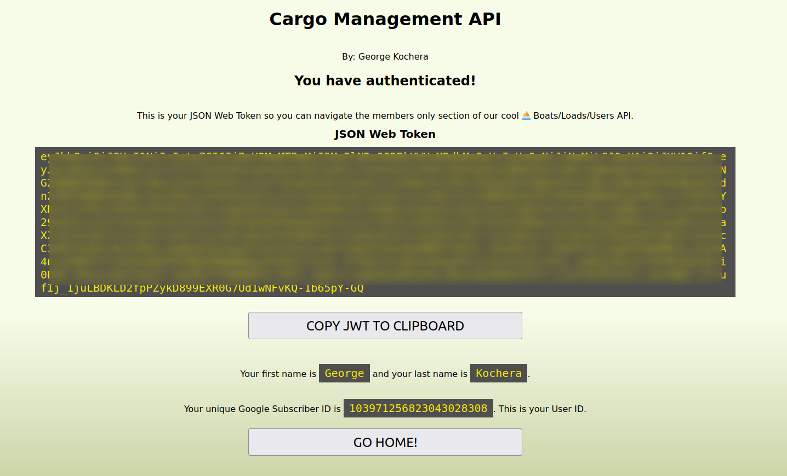

# Cargo Management API


# Documentation

The application is documented in PDF format [here](http://kg-final9.ue.r.appspot.com/docs). It covers the data model for this project, the access levels for each endpoint as well as a comprehensive overview of accessing each endpoint. It is 66 pages long.

# About the API

The Cargo Management API is built using Node.js. Data storage is handled by Google Datastore (in Datastore Mode). The entire application is deployed to Google Cloud Platform. The test suite was constructed in Postman and contains a bit of JavaScript for Pre-Request and Post-Request scripts. The tests leverage the Chai.js library.

This was my Final Portfolio Project for Oregon State University's `CS493 - Cloud Application Development` course. It's a RESTful API that was built using Node.js and deployed to Google Cloud Platform. I keep it up and running since it is a great representation of my work in this class and my experience building RESTful APIs.

# Getting Started

Start by visiting http://kg-final9.ue.r.appspot.com. If you haven't already signed up, you must do that first by clicking 'Sign-Up with Google'.

> You will be required to authenticate with a Google account to gain access to the API. Your First Name, Last Name are used to present your name back to you on the page you'll see when you logged in. Your Google Subscriber ID (The `sub` value in your JWT) is saved in the datastore and used to connect you to elements in the database. This is the only data that is saved, parsed or utilized from your Google account with this application.

Once you have authenticated with Google, you will be presented with a new screen that displays the JWT along with your First and Last name as well as the value of your Google Subscriber ID.



This JWT is used as the `Bearer Token` in the `Authorization` header of any HTTP request made to any API endpoint. that is protected.

# Making a Request

All requests expect that the `Content-Type` of the HTTP request header is set to `application/json` and the `Accept` value of the HTTP request is also set to `application/json` or a semantically equivalent value.

Endpoints that are identified as `Protected` additionally require the generated JWT generated in the web application be submitted as a `Bearer` token in the `Authorization` header of the HTTP request.

# Endpoints

There exist endpoints for servicing Loads and Boats. There are also endpoints for Users which is a available for diagnostic purposes.

> Paginated endpoints return a maximum of 5 elements per request. Responses also contain a URI for the `next` page so users can request that data if required.

## Loads

|Method|Endpoint|Detail|Protected| Paginated|Body Required|
|------------|---------------|---------|-----------|---------|------------|
|POST|/loads|Add a Load| - | - | Yes |
|GET|/loads|Get a Load| - | Yes | - |
|GET|/loads/:load_id|Get a Specifc Load| - | - | - |
|PUT|/loads/:load_id|Change All Details of a Specific Load| When Load is embarked upon a Boat | - | Yes |
|PATCH|/loads/:load_id|Change Only Some Details of a Specific Load| When Load is embarked upon a Boat | - | Yes |
|DELETE|/loads/:load_id|Delete a Specific Load| When Load is embarked upon a Boat | - | - |

### Parameters

`:load_id` refers to the assigned `id` of the `Load` element in the database which is returned in the JSON body after a Load is created or a list of loads is requested.

### Sample Request Body

```JSON
{
    "volume": 900,
    "content": "Legos",
    "creation_date": "09/12/2014"
}
```

> Creation date is *not* auto-generated currently. The user expected to provide their desired value.

## Boats

|Method|Endpoint|Detail|Protected| Paginated|Body Required|
|------------|---------------|---------|-----------|---------|------------|
|POST|/boats|Add a Boat| Yes | - | Yes |
|GET|/boats|Get all Boats| Yes | Yes | - |
|GET|/boats/:boat_id|Get a Specific Boat| Yes | - | - |
|PUT|/boats/:boat_id|Change All Details of a Specific Boat| Yes | - | Yes |
|PATCH|/boats/:boat_id|Change Only Some Details of a Specific Boat| Yes | - | Yes |
|DELETE|/boats/:boat_id|Delete a Specific Boat| Yes | - | - |

### Parameters

`:boat_id` refers to the assigned `id` of the `Boat` element in the database which is returned in the JSON body after a Boat is created or a list of boats is requested.

### Sample Request Body

```JSON
{
    "name": "Grey Thunder",
    "type": "Schooner",
    "length": 340
}
```

## Loading and Unloading a Boat

|Method|Endpoint|Detail|Protected| Paginated|Body Required|
|------------|---------------|---------|-----------|---------|------------|
|PUT|/boats/:boat_id/loads/:load_id|Add a Specific Load to a Specific Boat| Yes | - | - |
|DELETE|/boats/:boat_id/loads/:load_id|Remove a Specific Load from a Specific Boat| Yes | - | - |

## Users

|Method|Endpoint|Detail|Protected| Paginated|Body Required|
|------------|---------------|---------|-----------|---------|------------|
|GET|/users|Get All Registered Users| - | Yes | - |
|GET|/users/:user_id|Get a Specific Registered User| - | - | - |

# Testing

A Postman test suite is included to demonstrate the robustness of the API. They can be found in the `/test` directory of this repo. The test suite consists of 290 tests across 155 separate requests.

The Postman collection is setup and ready to run. The environment is preset with the deployed version of the API and needs 4 fields filled in.


You'll need to generate **two** separate, valid JWTs from **two** separate Google accounts. The `jwt1` and `jwt2` field get the token value inserted into them. The `user_id1` and `user_id2` fields get populated with the `sub` value from the JWT for the respective token (i.e. the `sub` value for `jwt1` goes in `user_id1`, etc.) The `sub` value for the JWT can be found just below your name after logging into the web application.


