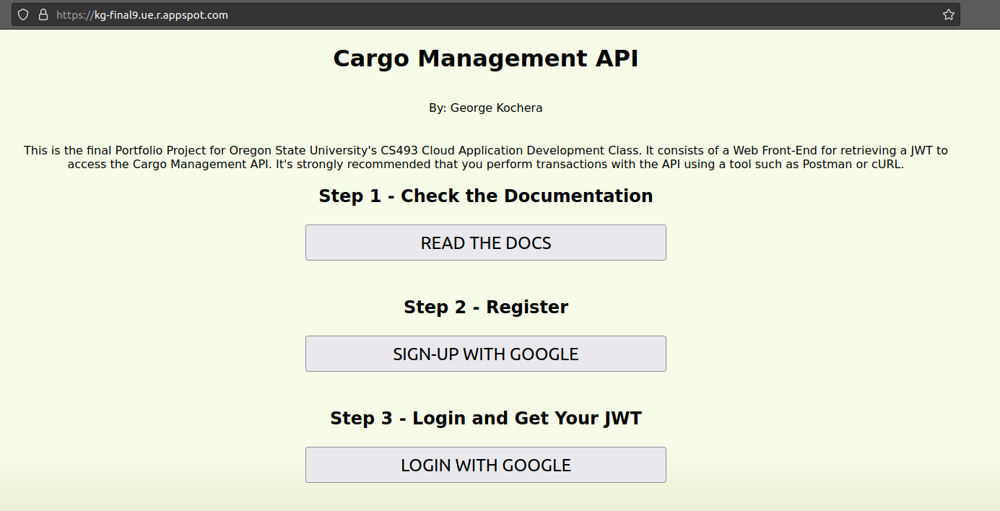

# Cargo Management API

This is was my Final Portfolio Project for Oregon State University's CS493 - Cloud Application Development course. It's a RESTful API that was built using Node.js and deployed to Google Cloud Platform. I keep it up and running since it is a great representation of my work in this class and my experience building RESTful APIs.

# Documentation

You can find the original PDF  that covers the data model for this project, the access levels for each endpoint as well as a comprehensive overview of accessing each endpoint.

# Getting Started

Start by visiting http://kg-final9.ue.r.appspot.com. If you haven't already signed up, you must do that first by clicking 'Sign-Up with Google'.

> You will be required to authenticate with a Google account to gain access to the API. Your First Name, Last Name are used to simply present your name back to you on the page you'll see when you logged in. Your Google Subscriber ID (The `sub` value in your JWT) is saved in the datastore and used to connect you to elements in the database. No other data is parsed, used or saved by this application.

Once you have authenticated with Google, you will be presented with a new screen that displays the JWT along with your First and Last name as well as the value of your Google Subscriber ID.

We will use that JWT as our `Bearer Token` in the `Authorization` header of any HTTP request that is protected.

